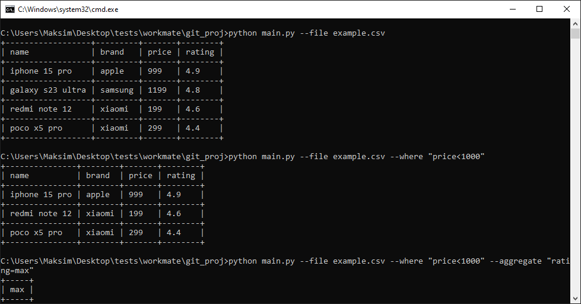
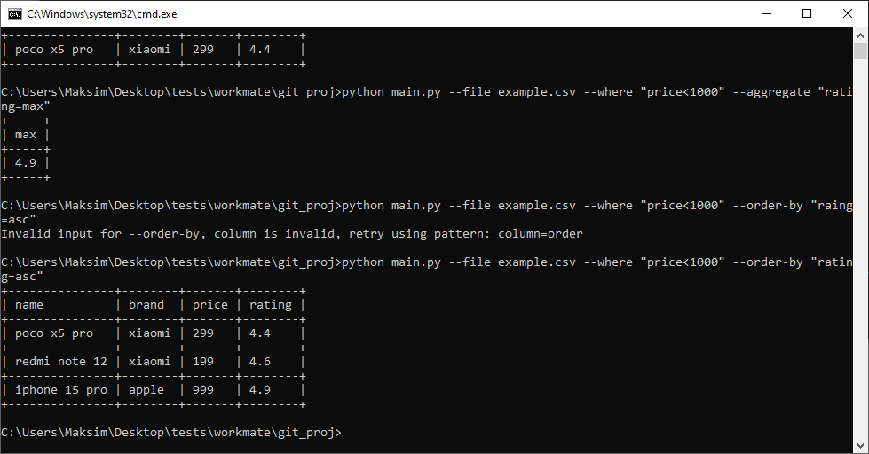

# Документация для скрипта обработки CSV-файлов

## Описание
Скрипт `main.py` предназначен для обработки CSV-файлов с возможностью фильтрации, сортировки и агрегации данных. Он поддерживает следующие функции:
- Чтение CSV-файла и автоматическое определение типов данных.
- Фильтрация строк по условиям (`>`, `<`, `=`).
- Сортировка данных по столбцу в порядке возрастания или убывания.
- Вычисление агрегированных значений (максимум, минимум, среднее) для числовых столбцов.

## Использование
Скрипт запускается из командной строки с аргументами:
- `--file`: Путь к CSV-файлу.
- `--where`: Условие фильтрации (например, `price<1000`).
- `--order-by`: Сортировка (например, `rating=asc`).
- `--aggregate`: Агрегация (например, `rating=max`).

